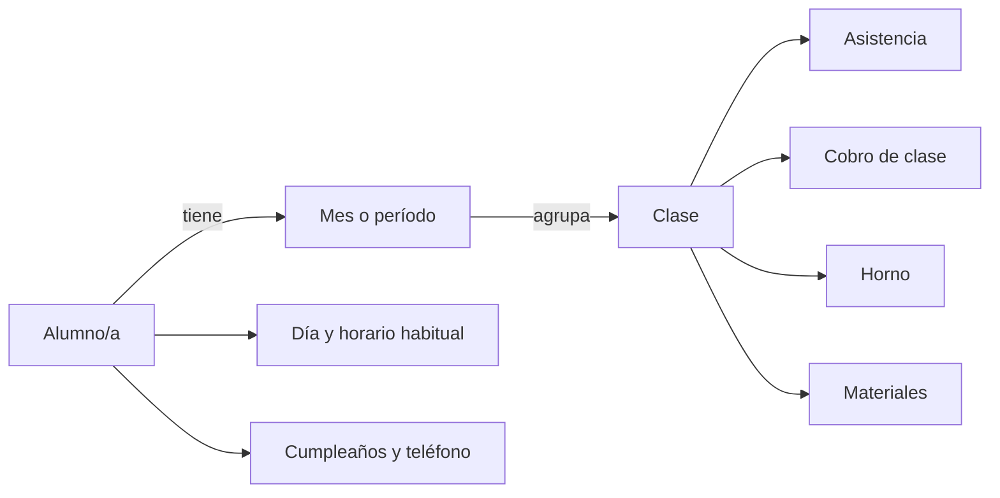
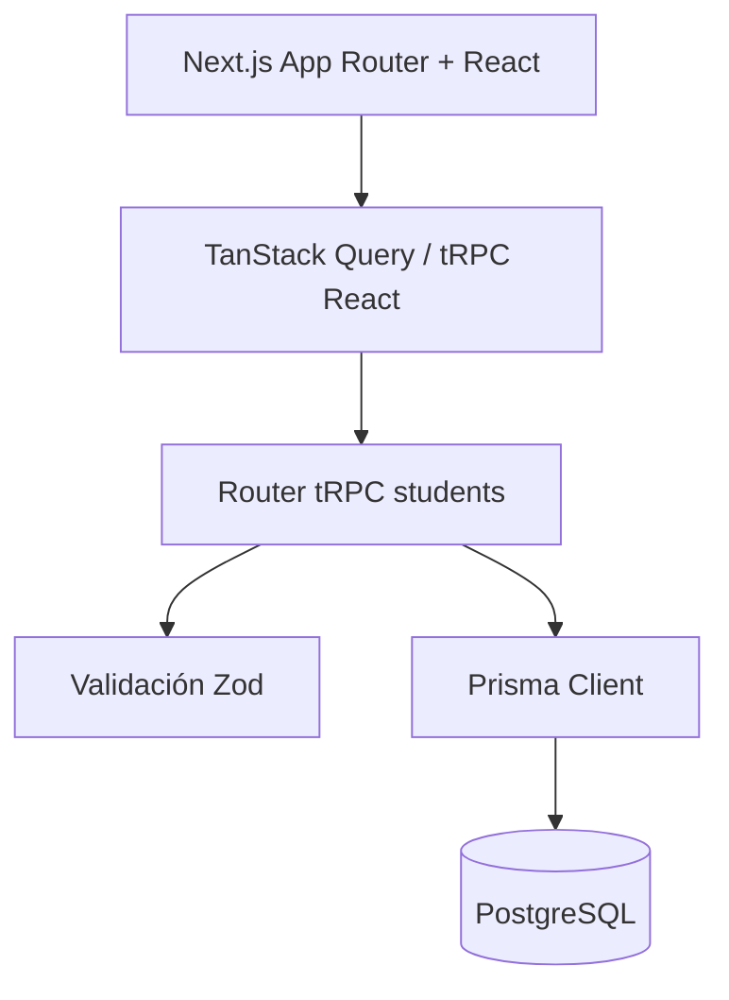

# Primer escaneo conceptual y lógico del proyecto

**Proyecto:** MD Cerámica / `tiendamd`  
**Fecha del escaneo:** 31 de agosto de 2026  
**Commit revisado:** `97c1c13` (`main`)  
**Alcance:** estructura, modelo de dominio, persistencia, API, flujos de interfaz, configuración y automatización. No es todavía una auditoría exhaustiva de seguridad ni una prueba funcional completa.

## 1. Resumen ejecutivo

El repositorio implementa un panel interno para administrar alumnas/os de un taller de cerámica. Permite registrar datos personales y horarios, agrupar clases por mes, controlar asistencia y registrar tres conceptos económicos: clase, horno y materiales.

La solución está construida como una aplicación full-stack monolítica con Next.js, React, tRPC, Prisma y PostgreSQL. Conceptualmente es un MVP pequeño y entendible; la navegación principal y el modelo `Student -> Month -> Class` representan de forma directa el flujo de trabajo del taller.

El estado actual parece más cercano a un **prototipo funcional en evolución** que a una aplicación lista para producción. Los principales motivos son:

1. Todas las lecturas y mutaciones de tRPC son públicas, incluidas las eliminaciones.
2. No existen migraciones versionadas ni pruebas automatizadas.
3. El tratamiento de fechas tiene riesgo de mostrar el día anterior en zonas horarias negativas, como Argentina.
4. El modelo monetario es inconsistente: la clase usa `Decimal`, mientras horno y materiales se almacenan como texto.
5. La documentación y los flujos de CI no describen ni validan correctamente el proyecto actual.

## 2. Propósito del producto

### Problema que resuelve

Centraliza la operación cotidiana de MD Cerámica:

- alta y edición de alumnas/os;
- asignación de día y horario habitual;
- consulta agrupada por día y horario;
- creación de períodos mensuales por alumna/o;
- alta y edición de clases;
- seguimiento de asistencia;
- seguimiento de cobros de clase, horno y materiales;
- visualización de próximos cumpleaños.

### Usuarios inferidos

El código no define roles ni autenticación. Por el vocabulario y los flujos, se infiere un único tipo de usuario: la persona administradora o docente del taller. Si la aplicación fuera accesible desde Internet, esta suposición debería convertirse en una regla explícita mediante autenticación y autorización.

### Madurez estimada

**MVP/prototipo operativo.** La funcionalidad central existe, pero todavía faltan garantías de integridad, seguridad, despliegue reproducible, observabilidad y pruebas.

## 3. Modelo conceptual del dominio

### Entidades actuales

#### Student

Representa a la alumna o alumno. Contiene nombre, cumpleaños, teléfono, día preferido y un horario de una lista cerrada (`10:00`, `16:00`, `18:30`).

#### Month

Es un agrupador textual de clases perteneciente a una persona. Su unicidad se define por `studentId + label`.

#### Class

Registra una clase concreta con fecha, nombre, asistencia, precio y estado de pago. También contiene datos de horno y materiales dentro de la misma fila.

### Observaciones conceptuales

- La relación `Student -> Month -> Class` es simple y adecuada para el alcance actual.
- `Month.label` funciona a la vez como presentación e identidad del período. Valores como `Mayo 2024`, `mayo 2024` y `05/2024` serían períodos distintos.
- `Student.day` es texto libre, aunque la interfaz necesita interpretarlo como día de semana. Esto permite datos que luego quedan en “Sin día”.
- `Timetable` sí está modelado como enum, pero su conversión se repite entre Prisma, API y formularios.
- Los conceptos de horno y materiales parecen cargos asociados a una clase, pero no están modelados como importes numéricos ni como ítems independientes.
- No existe un estado explícito de alumna/o activo o inactivo, aunque la interfaz llama “Alumnos activos” al total completo.
- No está definida la regla de negocio para el “total”: hoy las estadísticas suman únicamente el precio de la clase y excluyen horno y materiales.

## 4. Arquitectura técnica

### Capas observadas

- **Presentación:** `src/app` y `src/app/_components`.
- **Estado remoto:** tRPC React y TanStack Query.
- **API:** un único router `students` con consultas y mutaciones.
- **Validación y tipos:** esquemas Zod en `src/types/students.ts` y tipos derivados de Prisma/tRPC.
- **Persistencia:** Prisma 7 mediante el adaptador PostgreSQL y `pg`.
- **Estilos:** Tailwind CSS 4, Mantine y estilos globales.

### Flujo principal

1. El dashboard consulta `students.list`.
2. El servidor trae cada estudiante con todos sus meses y clases.
3. La API aplana las clases y agrega `monthLabel`.
4. El cliente calcula agrupaciones, estadísticas y cumpleaños.
5. Las mutaciones invalidan las consultas de lista y/o detalle para volver a cargar los datos.

### Aspectos bien resueltos

- El tipado fluye de Prisma a tRPC y desde tRPC hacia React.
- Zod valida la frontera de entrada de la API.
- La mutación `addClass` comprueba que el mes pertenezca al estudiante indicado.
- La eliminación de estudiante agrupa sus operaciones en una transacción.
- El orden del dashboard contempla día, horario y nombre.
- La conexión a Prisma y el pool se reutilizan en desarrollo para evitar múltiples instancias durante recargas.
- Las notificaciones e invalidaciones ofrecen una respuesta básica después de las mutaciones.

## 5. Flujos funcionales existentes

### Dashboard

- Búsqueda por nombre, sin distinguir mayúsculas/minúsculas.
- Totales de estudiantes y clases, calculados sobre el resultado filtrado actual.
- Formulario desplegable de alta de estudiante.
- Próximos cuatro cumpleaños.
- Listado agrupado por día y horario.
- Acceso al detalle y eliminación directa del estudiante.

### Detalle de estudiante

- Consulta por ID tomado de la URL.
- Edición de datos personales.
- Estadísticas de clases pagadas y pendientes.
- Alta de meses.
- Alta y edición de clases.
- Resumen de clase, asistencia y cobros asociados.

### Capacidades presentes en backend pero no expuestas en la interfaz

- Eliminación de clases (`students.deleteClass`).
- Listado global de clases (`students.classes`).

## 6. Hallazgos priorizados

### Prioridad crítica

#### 6.1. API sin autenticación ni autorización

Todas las operaciones usan `publicProcedure`, incluidas crear, actualizar y eliminar estudiantes y clases. Cualquier cliente con acceso a la aplicación puede modificar o borrar los datos.

**Impacto:** pérdida o exposición de información personal y operativa.  
**Acción sugerida:** definir el contexto de sesión, crear un procedimiento protegido y limitar todas las mutaciones; si el sistema es deliberadamente local, documentar y garantizar esa restricción de red.

#### 6.2. No hay migraciones versionadas

`prisma.config.ts` apunta a `prisma/migrations`, pero el repositorio sólo contiene `prisma/schema.prisma`. El script de producción usa `prisma migrate deploy`, que no tendría migraciones para aplicar.

**Impacto:** una base nueva no puede reconstruirse de manera confiable y los cambios de esquema no quedan auditados.  
**Acción sugerida:** crear una migración inicial a partir del estado confirmado de la base y adoptar un flujo único de migraciones.

### Prioridad alta

#### 6.3. Riesgo de desplazamiento de fechas por zona horaria

Las entradas `YYYY-MM-DD` se convierten con `new Date(...)` y luego se presentan con `toLocaleDateString`. Una cadena de fecha sin hora se interpreta normalmente como UTC; al mostrarse en Argentina puede convertirse en el día anterior. El mismo patrón aparece en cumpleaños y fechas de clase.

**Impacto:** cumpleaños y clases pueden mostrarse o calcularse con un día incorrecto.  
**Acción sugerida:** tratar las fechas de calendario como fechas sin zona horaria de extremo a extremo, evitando conversiones UTC implícitas y cubriendo el comportamiento con pruebas en `America/Argentina/Cordoba`.

#### 6.4. Modelo monetario inconsistente

`classPrice` es `Decimal`, pero `ovenPrice` y `materialPrice` son `String`. Zod acepta cualquier texto para estos dos últimos y los formularios tampoco los tipan como números. Las estadísticas sólo suman `classPrice`.

**Impacto:** importes inválidos, cálculos incompletos y dificultad para generar deuda o reportes confiables.  
**Acción sugerida:** usar `Decimal` para todos los importes, definir si cada estado de pago se calcula por ítem y centralizar la lógica de totales.

#### 6.5. Eliminación destructiva sin confirmación

El botón de papelera elimina inmediatamente al estudiante y, mediante la transacción, todas sus clases y meses. No existe confirmación, papelera lógica ni recuperación.

**Impacto:** pérdida accidental de todo el historial de una persona.  
**Acción sugerida:** agregar confirmación explícita y considerar baja lógica o respaldo antes de habilitar esta acción en producción.

#### 6.6. CI/CD desalineado con el repositorio

Hay dos workflows. Ambos usan Node 16 y `npm install`, aunque el proyecto declara pnpm y Next.js 15. Uno intenta entrar en un directorio `backend` inexistente y habla de Express. El build también requiere `DATABASE_URL`, pero los workflows no la configuran.

**Impacto:** las verificaciones y despliegues automáticos probablemente fallen o no sean reproducibles.  
**Acción sugerida:** conservar un solo workflow, usar la versión de Node compatible, `pnpm --frozen-lockfile`, una URL de base segura para build y los comandos reales del proyecto.

### Prioridad media

#### 6.7. Los campos opcionales no siempre pueden limpiarse

En las actualizaciones, una fecha vacía se transforma en `undefined`, lo que Prisma interpreta como “no modificar”. El horario vacío sigue el mismo patrón. Por eso una fecha de cumpleaños, fecha de clase u horario existente puede ser difícil o imposible de borrar desde la interfaz.

**Acción sugerida:** distinguir explícitamente `undefined` (sin cambio) de `null` (borrar valor) en esquemas, formularios y mutaciones.

#### 6.8. Validación numérica insuficiente

`classPrice` convierte texto con `Number(...)`, pero no exige que el resultado sea finito, no negativo ni compatible con la precisión esperada. Horno y materiales no tienen validación numérica.

**Acción sugerida:** validar importes como números finitos, no negativos y con una escala definida.

#### 6.9. Orden no determinista de meses y clases

Las consultas anidadas no especifican `orderBy`. La interfaz usa `data.months[0]` como mes por defecto y muestra clases en el orden recibido, que la base no garantiza.

**Acción sugerida:** definir el orden de períodos y clases en la consulta y modelar el período con año/mes en lugar de depender sólo de una etiqueta.

#### 6.10. Carga completa del grafo en el dashboard

Cada búsqueda obtiene todos los estudiantes coincidentes con todos sus meses y todas sus clases. Las estadísticas y agrupaciones se calculan en el cliente y no hay paginación.

**Impacto:** el payload y el tiempo de respuesta crecerán con todo el historial.  
**Acción sugerida:** separar resumen, listado y detalle; agregar conteos en servidor y paginación cuando el volumen lo justifique.

#### 6.11. Complejidad y duplicación en la interfaz

`student-detail.tsx` tiene cerca de 870 líneas y repite los formularios de clase. Ya existen `ClassForm`, `ClassBadge`, `Banner` y otro componente de botón que no se utilizan. Además, `StudentPersonalDetail` importa `Button` desde el componente padre, creando una dependencia circular.

**Acción sugerida:** extraer formularios y tarjetas reales, ubicar los componentes base en módulos independientes y retirar código muerto.

#### 6.12. Restablecimiento de borrador con clave incorrecta

Después de crear una clase se agrega un borrador a `classDrafts` usando `variables.studentId` como clave, aunque ese mapa está indexado por `classId`. La recarga posterior suele ocultar el problema, pero la intención y la clave no coinciden.

**Acción sugerida:** eliminar ese bloque o indexarlo con el ID de clase realmente devuelto.

### Prioridad baja / deuda de producto

#### 6.13. Documentación genérica

El README conserva el texto inicial de Create T3 App, menciona NextAuth y Drizzle aunque no están instalados, y no explica el dominio, la configuración, las migraciones ni el despliegue.

#### 6.14. Sin pruebas automatizadas

No hay archivos de prueba ni script `test`. Las reglas más sensibles —fechas, totales, pertenencia mes/estudiante, borrados y orden— no tienen cobertura.

#### 6.15. Semántica y accesibilidad incompletas

El documento declara `lang="en"` aunque la aplicación está en español. El enlace “Ver detalle” está anidado dentro de un botón, lo que mezcla controles interactivos. Varios inputs dependen sólo de `placeholder` y carecen de etiquetas asociadas.

#### 6.16. Uso parcial del renderizado de servidor

Las páginas envuelven contenido en `HydrateClient`, pero no precargan las consultas. El dashboard y el detalle cargan sus datos exclusivamente en componentes cliente. No es un error funcional, aunque hace que la hidratación añadida aporte poco.

#### 6.17. Posible desalineación de configuración Tailwind 4

El proyecto mantiene un `tailwind.config.ts` tradicional y usa Tailwind 4. Conviene comprobar durante el build que los colores personalizados (`primary`, `plum`, `sand`, etc.) se generen realmente; `globals.css` no referencia explícitamente ese archivo de configuración.

## 7. Estado de calidad y operación

### Comprobado por inspección

- 44 archivos versionados.
- Rama `main` limpia al iniciar el escaneo.
- No hay carpeta de migraciones versionada.
- No hay pruebas automatizadas.
- No hay autenticación ni procedimientos protegidos.
- Existen dos workflows de GitHub Actions desalineados entre sí y con la estructura actual.
- El README no documenta la aplicación real.

### Verificaciones intentadas

- `pnpm typecheck`: no pudo ejecutarse porque no existe `node_modules` y `tsc` no está instalado localmente.
- `pnpm format:check`: no pudo ejecutarse por la misma razón; `prettier` no está instalado localmente.
- No se ejecutó build ni conexión a PostgreSQL para evitar instalar dependencias o modificar el entorno durante este primer escaneo.

Por lo tanto, este informe diferencia observaciones estáticas comprobadas de riesgos que requieren una ejecución posterior.

## 8. Plan de saneamiento recomendado

### Fase 1 — Proteger datos y hacer reproducible el sistema

1. Confirmar si la aplicación será local o accesible desde Internet.
2. Implementar autenticación y proteger todas las mutaciones.
3. Crear y validar la migración inicial.
4. Corregir el manejo de fechas de calendario.
5. Agregar confirmación o baja lógica para estudiantes.
6. Reemplazar los workflows por una única pipeline funcional.

### Fase 2 — Consolidar reglas del dominio

1. Definir qué integra el total adeudado y pagado.
2. Migrar todos los importes a `Decimal`.
3. Modelar día y período con valores estructurados.
4. Permitir borrar correctamente campos opcionales.
5. Definir orden estable para meses y clases.
6. Agregar pruebas de integración para las mutaciones y pruebas unitarias para fechas y cálculos.

### Fase 3 — Mejorar mantenibilidad y experiencia

1. Dividir `student-detail.tsx` en componentes de responsabilidad única.
2. Reutilizar o retirar componentes hoy desconectados.
3. Separar las consultas de resumen y detalle.
4. Mejorar etiquetas, navegación y confirmaciones accesibles.
5. Reescribir el README con instalación, dominio, base de datos, comandos y despliegue.

## 9. Próximo escaneo sugerido

Una segunda pasada debería instalar las dependencias con el lockfile, levantar PostgreSQL en un entorno controlado y verificar:

- generación de Prisma y aplicación de esquema;
- `typecheck`, lint, formato y build de producción;
- estilos Tailwind personalizados;
- CRUD completo desde el navegador;
- comportamiento de fechas en la zona horaria de Argentina;
- totales y estados de pago con casos reales;
- errores de consola, accesibilidad básica y experiencia móvil.

## 10. Conclusión

El proyecto tiene una base tecnológica razonable y un dominio pequeño que se entiende rápido. Su principal fortaleza es la correspondencia directa entre las necesidades del taller y las entidades actuales. El siguiente salto de calidad no requiere sumar muchas funcionalidades: requiere formalizar seguridad, fechas, dinero, migraciones y pruebas. Resolver esos puntos convertiría el prototipo en una base mucho más confiable para continuar el producto.
